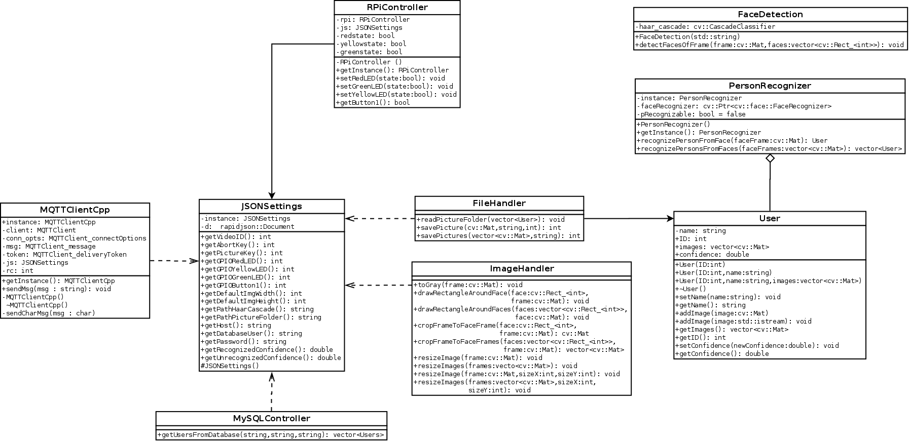

# FaceRecognition with OpenCV
developed by Justin Jagieniak, Gamze Söylev Öktem
## Licence
The project comes with the GNU General Public License.
(More informations you can find here: [GNU-License](https://en.wikipedia.org/wiki/GNU_General_Public_License))

## Abstract
This project is made to detect faces in a video camera and recognize the persons, whom the faces belong to. 
If a person is detected then it interacts with a raspberry pi.
## Installation Instruction
To compile the project you need to work with crosscompiling.  
The arm-cross folder is included by the project. If you want to link your own libraries then you have to correct the paths in the CMakeList.txt.  
The Raspberry Pi Binaries are useful if you want to compile on your raspberry directly.

Furthermore you need an arm compiler. You can install it by this commands in LinuxMint (Ubuntu-based) or Ubuntu:
sudo apt update &&  
sudo apt install gcc-arm-linux-gnueabihf &&  
sudo apt install g++-arm-linux-gnueabihf

Have fun!

## Class diagram

